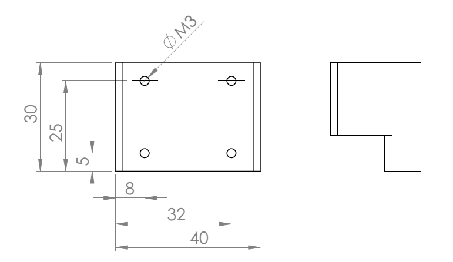

# PreciseXY - version 2
Affordable and precise XY and Z movement platform for scientific experimentation, now in the second iteration.

At the moment files of the design are being completed and will be published shortly.

## X, Y gantry

This CNC gantry is based on [Core (X,Y)](www.corexy.com) project, to explore and design a stable and precise mechanism with minimal part count. Trolley for mounting Z axis is connected with two stepper motors over the system of pulleys with two timing belts, one for each motor which provide movements in X, Y directions. Because of the cross section mounting of timing belts, good horizontal stability is achieved. Also we can use only two stepper motors no matter the number of linear guides used without compromising structural strength and accuracy. Z axis enables modular usage and installation of various needed systems. With that, utilization of the gantry is increased.

## Specification
 * Movement X: 300mm
 * Movement Y: 250mm
 * Movement Z: 35mm
 * Acceleration: up to 300mm/s^2
 * Speed: up to 18000mm/min
 * Weight: 
 
## GRBL settings, modified from defaults:
 * $3: 111 - dir port invert mask
 * $22: 1 - homing cycle, bool
 * $24: 1000 - homing feed, mm/min
 * $25: 5000 - homing seek, mm/min
 * $27: 2.000 - homing pull-off, mm
 * $100: 160 - x, step/mm
 * $101: 160 - y, step/mm
 * $102: 4000 - z, step/mm
 * $110: 18000 - x max rate, mm/min
 * $111: 18000 - y max rate, mm/min
 * $112: 500 - z max rate, mm/min
 * $120: 300 - x accel, mm/sec^2
 * $121: 300 - y accel, mm/sec^2
 * $122: 10 - z accel, mm/sec^2
 * $130: 300 - x max travel, mm
 * $131: 250 - y max travel, mm 
 * $132: 35 - z max travel, mm 

## Z attachment
The Z axis is designed such that a number of different toolheads can be attached to it. The Z axis mount has 4 M3 holes suitable for mounting a custom designed and 3d printed bracket. Drawing for designing the mounts is displayed here:

## Upgrades from version 1
The overall design has been improved for stability, ease of manufacturing and reliable machining, the following key upgrades have been made.
 * Added a double carriage on Y axis
 * Added endswitches
 * Optimized idler wheel placement for more precise movement
 * Optimized cabling, all electronics placed on the head via a durable flexible cable
 * Designed a new precise Z stage
 * Optimised carriage assembly
 * Eliminated x to y axis error due to corexy movement mechanics
 * Modified the Z axis carriage for scientific instrument mounting. 

---

#### License

All our projects are as usefully open-source as possible.

Hardware including documentation is licensed under [CERN OHL v.1.2. license](http://www.ohwr.org/licenses/cern-ohl/v1.2)

Firmware and software originating from the project is licensed under [GNU GENERAL PUBLIC LICENSE v3](http://www.gnu.org/licenses/gpl-3.0.en.html).

Open data generated by our projects is licensed under [CC0](https://creativecommons.org/publicdomain/zero/1.0/legalcode).

All our websites and additional documentation are licensed under [Creative Commons Attribution-ShareAlike 4 .0 Unported License] (https://creativecommons.org/licenses/by-sa/4.0/legalcode).

What this means is that you can use hardware, firmware, software and documentation without paying a royalty and knowing that you'll be able to use your version forever. You are also free to make changes but if you share these changes then you have to do so on the same conditions that you enjoy.

Koruza, GoodEnoughCNC and IRNAS are all names and marks of Institut IRNAS Rače. 
You may use these names and terms only to attribute the appropriate entity as required by the Open Licences referred to above. You may not use them in any other way and in particular you may not use them to imply endorsement or authorization of any hardware that you design, make or sell.

